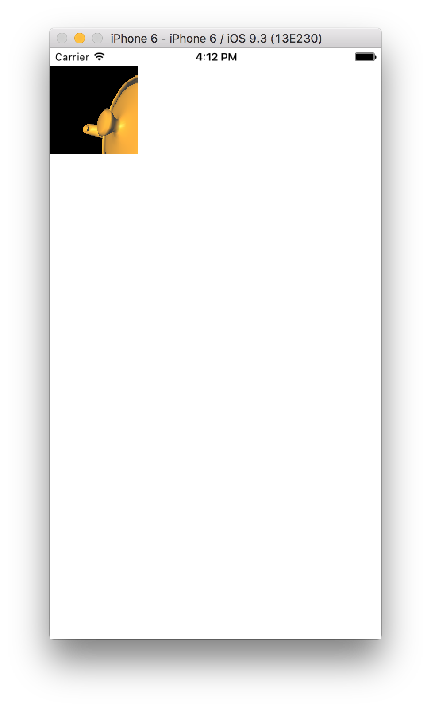

# Nativescript OpenTok

A Nativescript plugin for the OpenTok iOS and (coming soon Android) SDK.

OpenTok: https://tokbox.com/developer/

## Getting Started

### Prerequisites
1. API Key with OpenTok
2. Ability to generate a valid session id (either through OpenTok account or back-end service)
3. Ability to generate a valid token (either through OpenTok account or back-end service)

### Integration
Import OpenTok nativescript plugin into your Nativescript page (i.e. main-page.ts)
```
import {OpenTok} from 'nativescript-opentok';
```
Instantiate the OpenTok class and initialize using your API key and session id. Connect using a valid token and publish to the page you want to append the video stream to. 
```
export function pageLoaded(args: observable.EventData) {

    var page = <pages.Page>args.object;
    
    var openTok = new OpenTok();
    openTok.init('API_KEY', 'SESSION_ID', page.ios);
    openTok.doConnect('TOKEN');
    openTok.doPublish();
}
```

### Images



### References
- https://github.com/thepatrick/Opentok-HelloWorld-Swift
